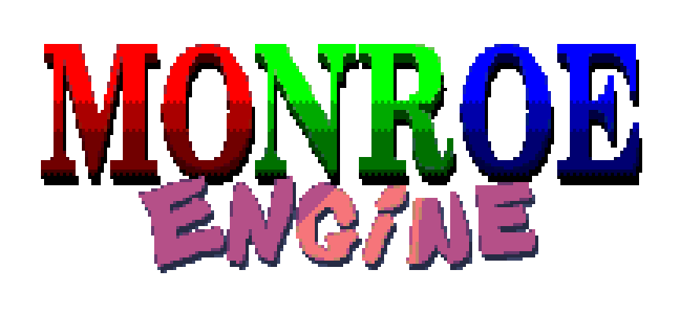

This engine is an open source solution to creating highly efficient
*retro* **OpenGL** games under ***Windows/Linux***. And mainly my insane solution
to achieving certain oddly specific techniques. It's fun sometimes. *Sometimes.*

## Monroe's Features

* **OpenGL 4.6**! (not used to the fullest)
* **GNU99** standard.
* **.7z** archive asset support.

## Libraries Used / Dependencies

(Italics: single header lib, Bold: big/unusual lib)

* **SDL2** (not included...)
* *stb_image.h*
* *cute_sound.h*
* **PhysFS** (not included)
* **glad**

At most, you'll just need `make` and `GCC`. 
Get you the newest one though! May compile way better.
(this project is currently being developed on Windows. I apologize
for needing to modify the Makefile for Linux purposes.)

## License

MIT. All I'm owned is a shout out. Go nuts!

### Should I actually use this?

***I DON'T THINK SO.*** It's bare, stupid, and made for lunatics who obsess over
minute graphical details and techniques in games, of which I'm the arguably most.

Take this more as reference for how these can be done. Not for how to do them *well*.
