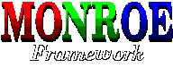

This framework is an open source solution to creating highly efficient
*retro* **OpenGL** games under ***Windows/Linux***.

## *Monroe in Action!*

### Goal Boxing (WIP project by me and Nerdy San)
Goal Boxing shows all games about goals who's box!
Control *Jack Dominique Football* as he kicks a box into
the goal with all his might, and hear the announcer go
nuts over it. It's turbular, my man/girl.

## Monroe's Features

* **OpenGL 4.6**! (currently not used to the fullest)
* **GNU99** standard.
* **WAV** & **Ogg Vorbis** support through *cute_sound.h*.
* **.7z** archive asset support.

## Libraries Used / Dependencies

* **SDL2** (not included)
* *stb_image.h*
* *cute_sound.h* + *stb_vorbis.c*
* *pl_mpeg.h* (not used yet!)
* **PhysFS** (not included)
* **glad**

At most, you'll just need `make` and `GCC`. 
Get you the newest one though! May compile way better.
(this project is currently being developed on Windows. I apologize
for needing to modify the Makefile for Linux purposes.)

## License

MIT. All I'm owned is a shout out. Go nuts!
